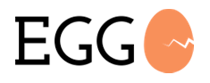

# EGG: Evolving Graph Generator

**EGG** is an open-source framework for generating evolving **RDF** graphs based on finely-tuned temporal constraints given by the user.

We built **EGG** on top of [**gMark**](https://github.com/graphMark/gmark), a state-of-the-art static graph generator. **EGG** takes as input (i) an initial graph generated by **gMark**, and (ii) an evolving graph configuration that encodes how the evolving properties of the nodes and edges of the graph from point (i) should evolve over time. The output of **EGG** is an **RDF** graph annotated with temporal information that encodes a sequence of graph snapshots satisfying the constraints given by the user.


**EGG has been accepted as a demo paper in ISWC 2017**. If you use EGG, please cite:

>@inproceedings{ACM17,

    author    = {Alami, K. and Ciucanu, R. and Mephu Nguifo, E.},

    title     = {{EGG}: A Framework for Generating Evolving {RDF} Graphs},
    
    booktitle = {ISWC Posters \& Demonstrations},
    
    year      = {2017}
  
  }

### Running example

To illustrate the different finely-tuned constraints that the user can specify as EGG input, we rely on the [Trip geographical database use-case](https://github.com/karimalami7/EGG/tree/master/use_cases/trip).

### Repository organization

The **EGG** repository is organised as follows:

* src/: directory of source code of **EGG**.

* use-cases/: one directory for each use case, where we put both **gMark** configuration and **EGG** configuration.

* demo/: 

  * For every use case (trip, social, dblp, shop, univ): script to run **EGG** and a directory containing output examples.
  For each of these use cases, we provide examples of plots generated by **EGG** in the *Accuracy* wikis that are accessible from the [**EGG** main wiki](https://github.com/karimalami7/EGG/wiki).
  
  * Scalability: script to evaluate scalability of **EGG**. More information in [**EGG** scalability wiki](https://github.com/karimalami7/EGG/wiki/Scalability).
  
  * System evaluation: script to evaluate historical reachability queries using **EGG** output. More information in the [system evaluation wiki](https://github.com/karimalami7/EGG/wiki/System-Evaluation:-Historical-Reachability-Queries).

### Running EGG

To begin working with **EGG**, please clone **EGG** and run the [requirement](https://github.com/karimalami7/EGG/blob/master/demo/scripts/requirement.sh) script, which checks and installs all software needed to run **EGG**:

```shell 
git clone https://github.com/karimalami7/EGG.git
cd EGG/demo/scripts/
sudo ./requirement.sh
```
To run **EGG** on a sample [play](https://github.com/karimalami7/EGG/tree/master/use_cases/play) use case, please run the following commands (assuming you are in the aforementioned demo/scripts directory):

```shell 
cd ../play
./play-script.sh
```
The different options from the above [play script](https://github.com/karimalami7/EGG/blob/master/demo/play/play-script.sh) are:

* *--rdf-output* : serialization of the evolving graph in RDF

* *--vg-output* : serialization of the evolving graph in version graph format

* *--plot-byproperty* : generate plots for all evolving properties defined in the **EGG** configuration

* *--plot-byobject* : generate plots for all node/edge objects showing the evolution of each of their properties

Feel free to modify the **gMark** configuration and **EGG** configurations from the [play](https://github.com/karimalami7/EGG/tree/master/use_cases/play) directory.

To run each provided use case X, where X is one of {trip, social, dblp, shop, univ}, please run:
```shell 
cd ../X
./X-script.sh
```

### Contact

* Karim Alami (Université Clermont Auvergne) [alami.karim7@gmail.com](mailto:alami.karim7@gmail.com)

* [Radu Ciucanu](http://ws.isima.fr/~ciucanu/) (Université Clermont Auvergne) [ciucanu@isima.fr](mailto:ciucanu@isima.fr)

* [Engelbert Mephu Nguifo](http://ws.isima.fr/~mephu/) (Université Clermont Auvergne) [mephu@isima.fr](mailto:mephu@isima.fr)
