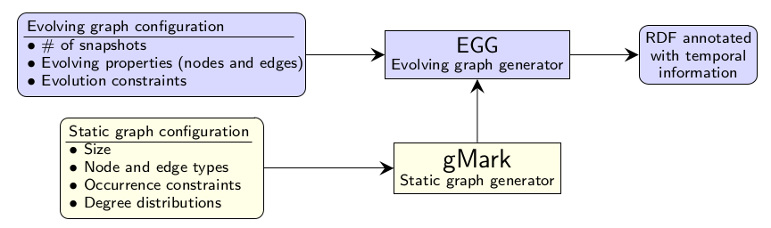

# EGG: Evolving Graph Generator

**EGG** is an open-source framework for generating evolving **RDF** graphs based on finely-tuned temporal constraints given by the user.

We built **EGG** on top of [**gMark**](https://github.com/graphMark/gmark), a state-of-the-art static graph generator. **EGG** takes as input (i) an initial graph generated by **gMark**, and (ii) an evolving graph configuration that encodes how the evolving properties of the nodes and edges of the graph from point (i) should evolve over time. The output of **EGG** is an **RDF** graph annotated with temporal information that encodes a sequence of graph snapshots satisfying the constraints given by the user.

### Running example

To illustrate the different finely-tuned constraints that the user can specify as EGG input, we rely on the [Trip geographical database use-case](https://github.com/karimalami7/EGG/tree/master/use_cases/trip).

### Repository organization

The **EGG** repository is organised as follow:

* src/: directory of source code of **EGG**.

* use-cases/: one directory for each scenario, where we put **gMark** schema and **EGG** configuration.

* demo/: 

  * For every scenario:  script to run **EGG** and directory of its ouputs.
  
  * Scalability: script to evaluate scalability of **EGG**. More informations in [**EGG** scalability wiki](https://github.com/karimalami7/EGG/wiki/EGG-scalability).
  
  * System evaluation: informations in the [system evaluation wiki](https://github.com/karimalami7/EGG/wiki/System-Evaluation:-Historical-Reachability-Queries).

### Running EGG

To begin working with **EGG**, please run the [requirement](https://github.com/karimalami7/EGG/blob/master/demo/scripts/requirement.sh) script, it checks and installs all software needed to run **EGG**.

Then feel free to modify **gMark** schema and **EGG** configuration in [play](https://github.com/karimalami7/EGG/tree/master/use_cases/play) scenario.

The final step, is to run **EGG** for this scenario by specifying the outputs you want in [play script](https://github.com/karimalami7/EGG/blob/master/demo/play/play-script.sh):

* **RDF** output: serialization of the evolving graph in RDF.

* **VG** output: serialization of the evolving graph in version graph format.

* Plot by property: generate evolution plots of all properties defined in the **EGG** configuration.

* Plot by object: generate evolution plots for properties of nodes and edges.  

